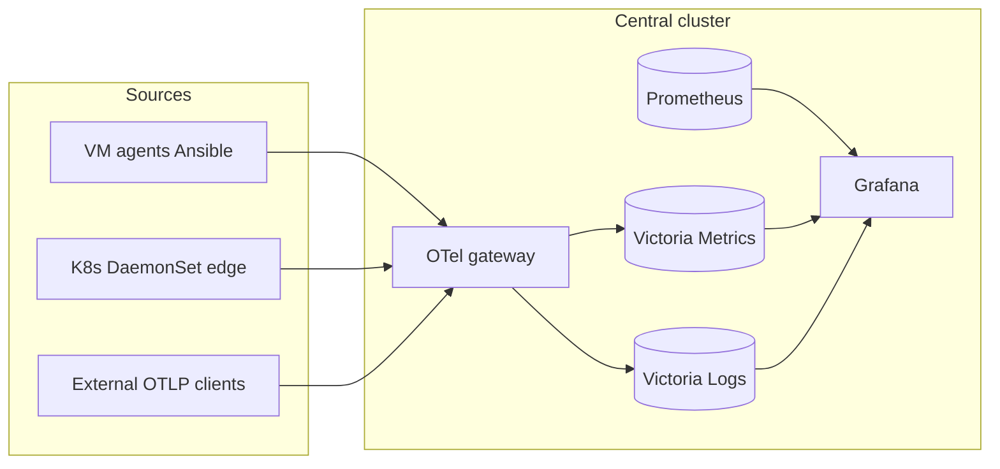

# Observability architecture

## Overview

**Central observability plane on Kubernetes**, plus **Ansible agents** for Linux VMs and remote clusters. Telemetry uses **OTLP** into a gateway, then **Victoria Metrics** (metrics) and **Victoria Logs** (logs). **Prometheus** scrapes independently; Grafana queries all three.

**Lab install:** `./scripts/helm-install-central.sh lab` → same `values.yaml` as production + `values.local.lab.yaml`.

## Components

| Component | Role |
|-----------|------|
| **OTel Collector (gateway)** | OTLP ingest; metrics → Victoria Metrics, logs → Victoria Logs |
| **Victoria Metrics** | Long-term OTLP metrics |
| **Victoria Logs** | OTLP logs |
| **Prometheus** | Scrapes (K8s, blackbox, SNMP) |
| **Grafana** | Dashboards, alerting, Explore |
| **observability-edge** | Per-cluster OTel DaemonSet |

## Data flow

## Paths in this repo

| Deployment | Path |
|------------|------|
| **Kubernetes central** | `charts/observability-central/` |
| **Kubernetes edge** | `charts/observability-edge/` |
| **KPI archive (optional)** | `charts/project-kpi/` |
| **VM / remote agents** | `playbooks/otel-agent/` |
| **GitOps samples** | `gitops/` |
| **Docs** | `docs/` |

Cloud / OpenStack teams are **OTLP consumers** only — see `docs/multi-cluster/otel-endpoint-cloud-team.md`.

## Design decisions

1. **OTLP as the agent contract** — clients need only the gateway URL.
2. **Victoria Metrics for OTLP metrics** — separate from Prometheus scrapes.
3. **Victoria Logs for OTLP logs** — current Kubernetes path.
4. **TLS at the edge** — Gateway / ingress terminates TLS; in-cluster HTTP is fine.
5. **GitOps TLS split** — certificates outside Helm to avoid Argo drift.
6. **Gateway API HTTPRoutes** — `templates/gatewayapi/` attach to a shared Gateway.
7. **Grafana mission orgs** — bootstrap Job + GitHub `org_mapping`.
8. **Backups** — `vmBackup` / `vlBackupCluster` CronJobs to S3-compatible storage.

## Assumptions

- Production: Gateway API (or compatible ingress) + cert-manager (or equivalent).
- SNMP jobs need an `snmp-exporter` and real management IPs (lab uses RFC 5737 examples).
