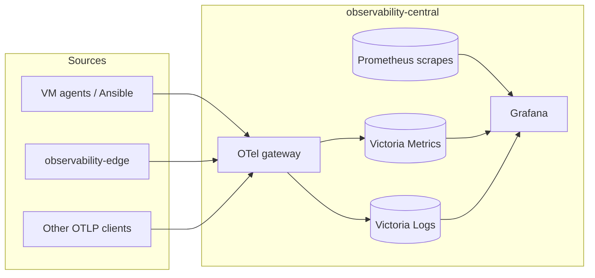

# Observability platform (reference implementation)

Deployable templates for a **central observability hub** and **remote collectors**, based on a production multi-team setup (Grafana mission orgs, Gateway API, Victoria stack, OpenTelemetry as the agent contract).

| Platform | What you get |
|----------|----------------|
| **Kubernetes** | Helm chart `observability-central`: Prometheus, Grafana 12, **Victoria Metrics**, **Victoria Logs**, OTel gateway + node DaemonSet, dashboards & alerting as code |
| **Linux VMs** | Docker Compose (`vm-docker/`) or **Ansible** agents pushing OTLP to the hub |
| **Other K8s clusters** | Chart `observability-edge` (DaemonSet → central OTLP URL) |

**Logs on Kubernetes:** OTLP → **Victoria Logs** (not Loki).  
**Logs on Docker Compose path:** **Loki** (see `observability/vm-docker/`).

---

## Quick start (≈15 min lab)

Prerequisites: a Kubernetes cluster (k3d, kind, minikube, …), `kubectl`, `helm`, ~**8 GB RAM** on the node, default **StorageClass**.

```bash
git clone https://github.com/dcaffese-cypher/observability-security-stack.git
cd observability-security-stack
chmod +x observability/scripts/*.sh
./observability/scripts/check-prerequisites.sh

./observability/scripts/create-grafana-secret.sh
./observability/scripts/helm-install-central.sh lab    # values.yaml + lab overlay
./observability/scripts/port-forward-ui.sh            # http://localhost:3000  (admin + your password)
```

Full paths (production, Docker VM, Ansible): **[observability/GETTING_STARTED.md](observability/GETTING_STARTED.md)**.

---

## How telemetry flows (Kubernetes)



Agents only need **`https://otel.<your-domain>`** (or port-forward in lab). They do not need Prometheus or Victoria URLs.

---

## Repository layout

```
observability/
  GETTING_STARTED.md      # Start here: lab, production, Docker, agents
  ARCHITECTURE.md         # Design decisions
  RUNBOOK.md              # Day-2 operations
  PLACEHOLDERS.md         # yourdomain.tld, YOUR_ORG, StorageClass, …
  docs/                   # Deep runbooks, multi-cluster, architecture notes
  kubernetes/
    charts/
      observability-central/   # Central stack (main Helm chart)
      observability-edge/      # Per-cluster OTel DaemonSet
      project-kpi/             # Optional VM KPI archive to S3
    gitops/                    # Argo CD Application + TLS examples
  ansible/otel-agent/        # OTel on Linux hosts & remote K8s
  vm-docker/                   # Compose: Prometheus + Loki + Grafana + OTel
  examples/grafana-dashboards/ # Extra sample dashboards (e.g. Wazuh)
  scripts/                     # install, secrets, port-forward, maintenance

integrations/                  # Optional: Zabbix, Wazuh automation
```

Legacy assets are kept on purpose (older dashboard JSON, APISIX gitops samples, Loki in Compose) so existing users can still follow older paths.

---

## Helm values (central chart)

| File | Use |
|------|-----|
| `values.yaml` | **Production template** (same shape as our live stack; placeholders for DNS, OAuth, S3) |
| `values.local.lab.yaml` | Lab overlay: no Gateway API / GitHub OAuth / S3 backup; default StorageClass |
| `values.local.production.example.yaml` | Copy → `values.local.yaml` and edit |
| `values-production.yaml` | Optional HA (Prometheus + OTel replicas) |

Install production-style:

```bash
cd observability/kubernetes/charts/observability-central
cp values.local.production.example.yaml values.local.yaml
# edit YOUR_DOMAIN, YOUR_STORAGE_CLASS, YOUR_GITHUB_ORG, gateway parentRef, S3…
helm dependency update
helm upgrade --install observability-central . -n observability --create-namespace \
  -f values.yaml -f values.local.yaml
```

---

## Documentation map

| Audience | Read |
|----------|------|
| First install | [observability/GETTING_STARTED.md](observability/GETTING_STARTED.md) |
| Chart details | [observability/kubernetes/charts/observability-central/README.md](observability/kubernetes/charts/observability-central/README.md) |
| Operations | [observability/RUNBOOK.md](observability/RUNBOOK.md) + [observability/docs/](observability/docs/README.md) |
| Replace hostnames & secrets | [observability/PLACEHOLDERS.md](observability/PLACEHOLDERS.md) |
| Cloud team OTLP only | [observability/docs/multi-cluster/otel-endpoint-cloud-team.md](observability/docs/multi-cluster/otel-endpoint-cloud-team.md) |

---

## Security

- Do **not** commit passwords, OAuth client secrets, kubeconfigs, or TLS private keys.
- Use `inventory.local.ini` / `values.local.yaml` (gitignored locally) for real hosts and domains.
- Maintainers mirroring from a private repo: run `observability/scripts/sanitize-for-public.py` before push.

---

## Integrations (optional)

Under **`integrations/`**: example automation for **Zabbix** and **Wazuh**. Not required for the core observability stack.

---

## License

Configure as appropriate for your organization when publishing or forking.
