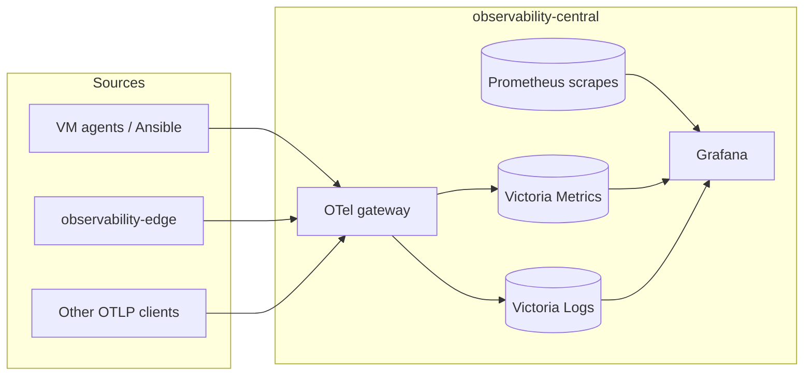

# Observability platform (reference implementation)

Same layout we use in production: Helm charts for a **central hub**, Ansible for agents, and docs/runbooks.

| Path | Role |
|------|------|
| **`charts/observability-central`** | Prometheus, Grafana 12, Victoria Metrics, Victoria Logs, OTel gateway + DaemonSet |
| **`charts/observability-edge`** | OTel DaemonSet for remote Kubernetes clusters |
| **`charts/project-kpi`** | Optional Victoria Metrics KPI archive → S3 |
| **`playbooks/otel-agent`** | Ansible: OTel agents on Linux VMs and remote K8s |
| **`gitops/`** | Sample Argo CD Application + TLS manifests |
| **`docs/`** | Architecture, multi-cluster, runbooks |
| **`scripts/`** | Lab install helpers |

**Logs:** OTLP → **Victoria Logs** (Kubernetes). Agents only need the OTLP URL.

---

## Repository layout

```
.
├── README.md
├── GETTING_STARTED.md
├── PLACEHOLDERS.md
├── ARCHITECTURE.md
├── RUNBOOK.md
├── charts/
│   ├── observability-central/
│   ├── observability-edge/
│   └── project-kpi/
├── playbooks/
│   └── otel-agent/
├── gitops/
├── docs/
└── scripts/
```

---

## Quick start (lab ≈15 min)

Prerequisites: Kubernetes (k3d/kind/minikube/…), `kubectl`, `helm`, ~**8 GB RAM**, default StorageClass.

```bash
git clone https://github.com/dcaffese-cypher/observability-security-stack.git
cd observability-security-stack
chmod +x scripts/*.sh
./scripts/check-prerequisites.sh

./scripts/create-grafana-secret.sh
./scripts/helm-install-central.sh lab
./scripts/port-forward-ui.sh
# http://localhost:3000  — user admin + the password you set
```

Full guide: **[GETTING_STARTED.md](GETTING_STARTED.md)**.

---

## How telemetry flows


```mermaid
flowchart LR
  subgraph sources["Sources"]
    VM[VM agents / Ansible]
    Edge[observability-edge]
    OTLP[Other OTLP clients]
  end
  subgraph central["observability-central"]
    GW[OTel gateway]
    VMm[(Victoria Metrics)]
    VL[(Victoria Logs)]
    Prom[(Prometheus scrapes)]
    Graf[Grafana]
  end
  VM --> GW
  Edge --> GW
  OTLP --> GW
  GW --> VMm
  GW --> VL
  Prom --> Graf
  VMm --> Graf
  VL --> Graf
```

---

## Helm values

| File | Use |
|------|-----|
| `charts/observability-central/values.yaml` | Production template (placeholders for DNS, OAuth, S3) |
| `values.local.lab.yaml` | Lab: no Gateway API / OAuth / S3 backup / cluster backends |
| `values.local.production.example.yaml` | Copy → `values.local.yaml` and edit |
| `values-production.yaml` | Optional HA (Prometheus + OTel replicas) |

Replace tokens before real production: **[PLACEHOLDERS.md](PLACEHOLDERS.md)**.

---

## Documentation

| Audience | Doc |
|----------|-----|
| First install | [GETTING_STARTED.md](GETTING_STARTED.md) |
| Chart details | [charts/observability-central/README.md](charts/observability-central/README.md) |
| Operations | [RUNBOOK.md](RUNBOOK.md) · [docs/](docs/README.md) |
| Cloud team (OTLP only) | [docs/multi-cluster/otel-endpoint-cloud-team.md](docs/multi-cluster/otel-endpoint-cloud-team.md) |

---

## Security

- Do **not** commit passwords, OAuth secrets, kubeconfigs, or TLS keys.
- Use `inventory.local.ini` / `values.local.yaml` locally for real hosts.
- Maintainers: `scripts/sanitize-for-public.py` before publishing overlays.

---

## License

Configure as appropriate for your organization when publishing or forking.
