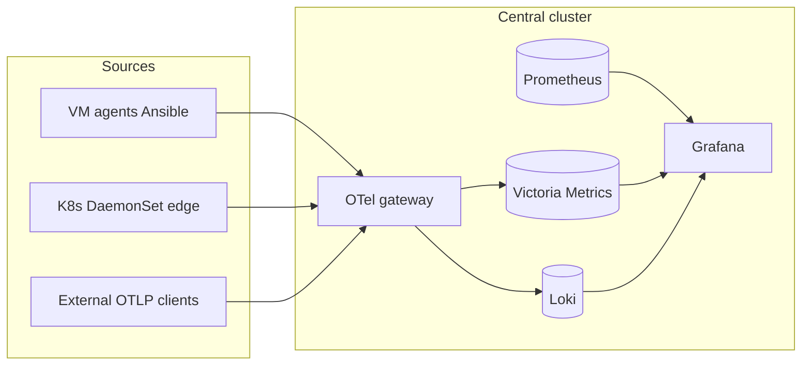

# Observability architecture

## Overview

This repository implements a **central observability plane** (Kubernetes) with **optional VM-based** Docker stacks (Proxmox / Linux VMs) and **Ansible-automated agents**. Telemetry flows over **OpenTelemetry Protocol (OTLP)** into a gateway, then to **Victoria Metrics** (metrics) and **Loki** (logs). **Prometheus** remains a first-class scrape engine; Grafana queries all backends.

## Components

| Component | Role |
|-----------|------|
| **OTel Collector (gateway)** | Ingests OTLP from cloud clusters, VMs, and K8s DaemonSets; routes metrics to VM, logs to Loki |
| **Victoria Metrics** | Long-term metrics store for OTLP-derived series |
| **Prometheus** | Scrapes Kubernetes, SNMP exporters, static targets |
| **Loki** | Log aggregation |
| **Grafana** | Dashboards, alerting, Explore / Drilldown |
| **observability-edge** | Per-cluster DaemonSet collector |

## Logical data flow

## VM / Proxmox vs cloud / OpenStack

| Deployment | Path in repo |
|------------|----------------|
| **Central stack on VM** (Docker Compose: Prometheus, Loki, Grafana, master OTel) | `vm-docker/central-stack/` |
| **VM agents** (journald + host metrics → master OTLP) | `vm-docker/agent-edge/` + `ansible/otel-agent/` |
| **Kubernetes central** (recommended for scale) | `kubernetes/charts/observability-central/` |
| **Kubernetes workload clusters** | `kubernetes/charts/observability-edge/` |

OpenStack or other clouds are **consumers** of the OTLP HTTPS endpoint; no OpenStack-specific chart is required beyond network reachability and TLS.

## Auxiliary tooling

| Path | Purpose |
|------|---------|
| `scripts/loki-maintenance/` | Loki / OTel maintenance examples |
| `scripts/prometheus-tsdb-trim/` | Trim oversized Prometheus TSDB blocks on Docker hosts |
| `scripts/demo-cleanup/` | **Demo only** — aggressive storage cleanup |

## Design decisions

1. **OTLP as the agent contract** — Cloud teams need only the gateway URL, not internal Prometheus/Loki URLs.
2. **Victoria Metrics for OTLP metrics** — Keeps Prometheus scrapes separate from push-style agent metrics.
3. **TLS at ingress** — Gateway and Grafana terminate TLS on the ingress controller; in-cluster traffic stays HTTP where typical.
4. **GitOps TLS split** — Certificates applied outside Helm to avoid perpetual Argo CD drift.

## Assumptions

- Ingress controller and cert-manager (or equivalent) exist on the central cluster.
- SNMP jobs require a deployed `snmp-exporter` and reachable management IPs.

## Extension points

- Add Prometheus `additionalScrapeConfigs` or ServiceMonitors.
- Add Loki tenants / S3 backend via subchart values.
- Extend OTel gateway pipelines in `config/otelcol-config.yaml`.
